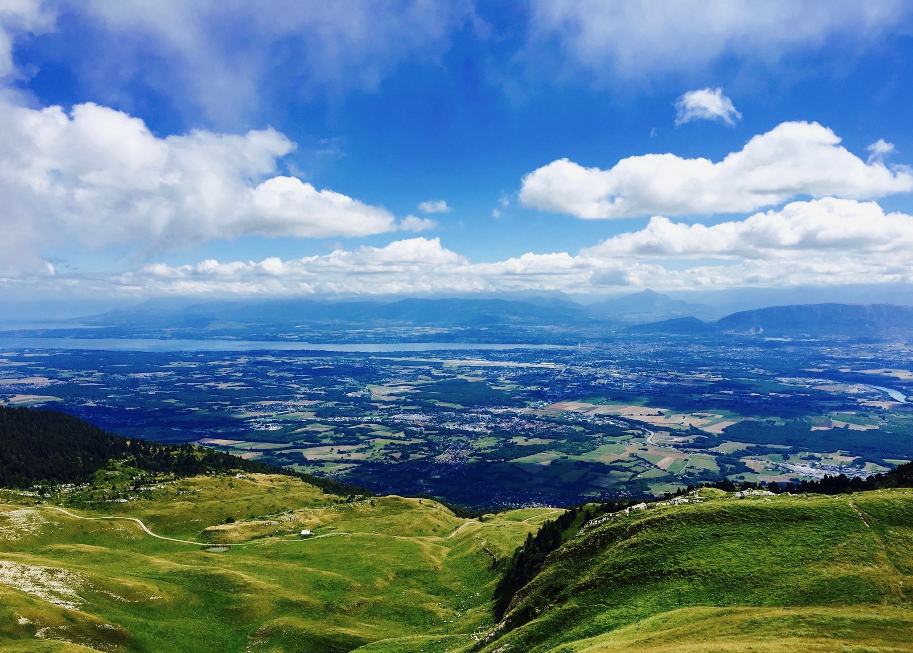

 
<!--

  

-->
# Hi there 👋

Welcome to my GitHub. My name is David,  I'm a Data scientist currently working at [Iliad/ Free](https://www.iliad.fr/en).
I daily use R. 
<h3 align="left">Languages and Tool</h3>

  

 
 

<!--
**Daviddlhy/Daviddlhy** is a ✨ _special_ ✨ repository because its `README.md` (this file) appears on your GitHub profile.

Here are some ideas to get you started:

- 🔭 I’m currently working on ...
- 🌱 I’m currently learning ...
- 👯 I’m looking to collaborate on ...
- 🤔 I’m looking for help with ...
- 💬 Ask me about ...
- 📫 How to reach me: ...
- 😄 Pronouns: ...
- ⚡ Fun fact:
-->

